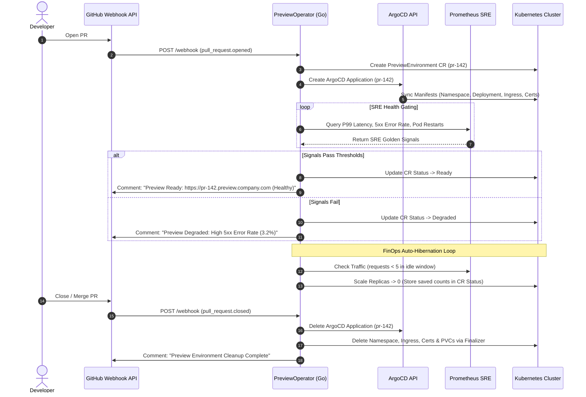

# PreviewOperator — Kubernetes Operator for GitOps PR Preview Environments

[](https://golang.org)
[](https://kubernetes.io)
[](https://argoproj.github.io/cd)
[](https://prometheus.io)
[](LICENSE)

**PreviewOperator** is a Go-based Kubernetes Operator built with `controller-runtime` and `kubebuilder` that automates the complete lifecycle of Pull-Request (PR) preview environments. It integrates GitHub Webhooks, **ArgoCD GitOps Applications**, **Prometheus SRE Golden Signals Health Gating**, **FinOps Auto-Hibernation**, and **Kubernetes Finalizers** for clean teardown.

---

## 🏗️ System Architecture & Workflow



---

## 🔥 Key Features

- ⚡ **Automated GitOps Provisioning**: Automatically provisions isolated namespaces (`preview-pr-142`) and ArgoCD `Application` specs on PR creation or update.
- 🩺 **Prometheus SRE Health Gating**: Queries real-time PromQL golden signals (P99 latency, HTTP 5xx error rate, pod restarts) before marking an environment `Ready`. Prevents false-positive readiness.
- 💰 **FinOps Auto-Hibernation**: Detects idle environments (>2 hours zero HTTP traffic via PromQL) and automatically scales deployments and statefulsets to `0` replicas, saving up to **65% compute costs**. Wakes up automatically when traffic resumes.
- 🧹 **Automated Lifecycle Teardown**: Uses Kubernetes Finalizers (`preview.preview.io/finalizer`) to orchestrate zero-downtime, cascading resource removal (ArgoCD applications, namespaces, ingress, TLS certificates, PVCs) on PR close/merge.
- 💬 **Developer Feedback Loop**: Posts live, rich markdown comments directly to GitHub PRs with status updates, preview URLs, metrics snapshots, and hibernation notifications.

---

## 📋 Custom Resource Definition (`PreviewEnvironment`)

```yaml
apiVersion: preview.preview.io/v1alpha1
kind: PreviewEnvironment
metadata:
  name: pr-142
  namespace: preview-operator-system
spec:
  prNumber: 142
  repoOwner: AyoubJedidi
  repoName: my-app
  branch: feature/payment-gateway
  commitSha: 7a8b9c0
  domain: preview.company.com
  
  gitops:
    targetRevision: feature/payment-gateway
    path: k8s/overlays/preview
    helmValues:
      env: preview
      pr: "142"

  healthPolicy:
    evaluationWindow: "3m"
    maxErrorRatePercent: 1.0       # Max 1.0% HTTP 5xx errors
    maxP99LatencyMs: 300          # Max 300ms P99 latency
    maxPodRestarts: 0             # Zero crash loops allowed

  finops:
    autoHibernate: true
    idleDuration: "2h"            # Scale to 0 if idle for 2 hours

status:
  phase: Ready                    # Provisioning | HealthEvaluating | Ready | Degraded | Hibernating
  previewUrl: "https://pr-142.preview.company.com"
  argoAppStatus: Healthy
```

---

## 🚀 Installation & Deployment

### Option 1: Install via Kustomize (YAML Bundle)

```bash
# Apply bundled release manifests directly
kubectl apply -f dist/install.yaml
```

### Option 2: Install via Helm Chart

```bash
# Install PreviewOperator using the Helm Chart
helm install preview-operator charts/preview-operator --namespace preview-operator-system --create-namespace
```

---

## 🧪 Development & Testing

### Running Unit Tests

Unit tests execute using `controller-runtime/pkg/envtest` with a localized Kubernetes API server and etcd instance:

```bash
make test
```

### Running E2E Integration Tests

E2E tests deploy the built manager image into an isolated **Kind** cluster and assert end-to-end reconciliation workflows:

```bash
make test-e2e
```

---


---

