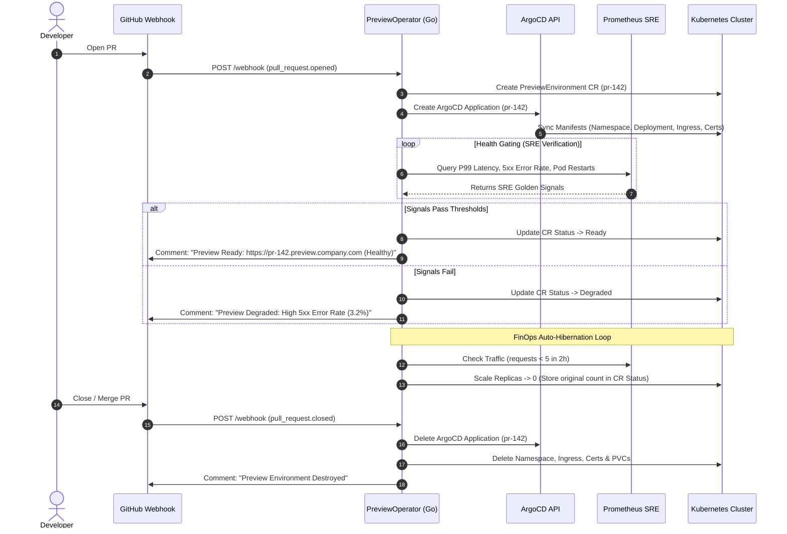

# PreviewOperator — Project Specification & Technical Roadmap

---

## 1. Description & Overview

**PreviewOperator** is a Kubernetes Operator written in **Go** that automates the full lifecycle of Pull-Request (PR) preview environments. It connects GitHub webhooks, **ArgoCD**, **Prometheus SRE metrics**, and cloud-native networking to give engineering teams live, isolated testing URLs (`pr-142.preview.company.com`) for every PR.

### The Problem
- **Manual Overhead**: Provisioning namespaces, databases, DNS, TLS, and ArgoCD Applications per PR is slow and error-prone.
- **False-Positive Readiness**: Existing tools only check `pod.status == Running`. If an application has hidden crash loops, database connection failures, or high latency on startup, developers waste time testing broken environments.
- **Resource & Budget Waste**: Preview environments are left running 24/7. Nights and weekends burn cloud compute budgets because developers forget to delete them.

### The Solution
A Go-based Kubernetes Operator using `controller-runtime` and `kubebuilder` that:
1. Listens to GitHub PR webhooks and provisions isolated ArgoCD Applications, namespaces, ExternalDNS records, and cert-manager TLS certificates.
2. **SRE Health Gating**: Queries Prometheus for Golden Signals (P99 latency, HTTP 5xx error rate, pod restarts) before marking the environment `Ready`. If health checks fail, it marks the environment `Degraded` and reports the exact metrics issue back to GitHub.
3. **FinOps Auto-Hibernation**: Detects idle preview environments (>2 hours of zero traffic) and scales deployments to `0` replicas while storing state in the custom resource. Wakes up automatically when traffic arrives.
4. **Automated Teardown**: Automatically destroys all associated resources (namespace, PVCs, ArgoCD apps, DNS records) when the PR is closed or merged.

---

## 2. System Architecture & Workflow



---

## 3. Technology Stack Matrix

| Layer | Technology / Tool | Rationale / Usage |
| :--- | :--- | :--- |
| **Language** | **Go (Golang 1.22+)** | Core language for Cloud-Native & Kubernetes Operator development. |
| **Operator Framework** | **`kubebuilder` / `controller-runtime`** | Standard CNCF framework for building K8s CRDs and reconcilers. |
| **GitOps Engine** | **ArgoCD (Application API / CMP)** | Declarative Application lifecycle management. |
| **SRE / Observability** | **Prometheus API & PromQL** | Real-time golden signals querying for health gating. |
| **Networking & Ingress** | **ExternalDNS, cert-manager, NGINX Ingress / Traefik** | Dynamic DNS generation (`pr-X.preview.domain.com`) and TLS certificates. |
| **CI/CD Integration** | **GitHub Actions / GitHub Webhooks API** | Triggers operator reconciles and posts automated status comments. |
| **Testing Environment** | **`k3d` / `kind` (Local), AWS EKS or OVH MKS (Cloud)** | Multi-node cluster simulation for testing. |

---

## 4. Custom Resource Definition Spec (`PreviewEnvironment`)

```yaml
apiVersion: preview.io/v1alpha1
kind: PreviewEnvironment
metadata:
  name: pr-142
  namespace: preview-operator-system
spec:
  prNumber: 142
  repoOwner: AyoubJedidi
  repoName: my-microservices-app
  branch: feature/payment-gateway
  commitSha: 7a8b9c0
  domain: preview.company.com
  
  # GitOps configuration
  gitops:
    targetRevision: feature/payment-gateway
    path: k8s/overlays/preview
    helmValues:
      env: preview
      pr: "142"

  # SRE Health Gating Policy
  healthPolicy:
    evaluationWindow: "3m"
    maxErrorRatePercent: 1.0       # Max 1% HTTP 5xx errors
    maxP99LatencyMs: 300          # Max 300ms latency
    maxPodRestarts: 0             # Zero crash loops allowed

  # FinOps Hibernation Policy
  finops:
    autoHibernate: true
    idleDuration: "2h"            # Scale to 0 if zero traffic in 2 hours

status:
  phase: Ready                    # Pending | Provisioning | HealthEvaluating | Ready | Degraded | Hibernating
  previewUrl: "https://pr-142.preview.company.com"
  argoAppStatus: Healthy
  
  # SRE Verification Metrics Snapshot
  sreMetrics:
    currentErrorRatePercent: 0.05
    currentP99LatencyMs: 142.5
    currentPodRestarts: 0
    lastEvaluatedAt: "2026-08-11T14:30:00Z"
    
  # Saved State for Hibernation
  hibernation:
    isHibernating: false
    savedReplicas:
      web-deployment: 2
      api-deployment: 3
    lastActiveAt: "2026-08-11T14:30:00Z"
```

---

## 5. Phased Build Roadmap

### Phase 1: Go Environment & Operator Scaffold (`kubebuilder`)
- **Goal**: Set up Go development environment and scaffold the Operator codebase.
- **Tasks**:
  1. Install Go 1.22+, `kubebuilder`, `kubectl`, and `k3d`.
  2. Initialize the project repository: `kubebuilder init --domain preview.io --repo github.com/AyoubJedidi/preview-operator`.
  3. Create the API CRD: `kubebuilder create api --group preview --version v1alpha1 --kind PreviewEnvironment`.
  4. Define `PreviewEnvironmentSpec` and `PreviewEnvironmentStatus` Go structs in `api/v1alpha1/previewenvironment_types.go`.
  5. Generate manifests and CRDs: `make manifests generate`.
- **Verification**: `make build` completes with zero errors and CRD installs into local k3d cluster via `make install`.

---

### Phase 2: Webhook Receiver & GitHub Integration
- **Goal**: Receive PR events from GitHub and convert them into `PreviewEnvironment` Custom Resources.
- **Tasks**:
  1. Implement an HTTP Webhook server in Go using `net/http` or Gin.
  2. Validate GitHub Webhook HMAC signatures (`X-Hub-Signature-256`) using a shared secret.
  3. Parse `pull_request` event payloads (`opened`, `reopened`, `synchronize`, `closed`).
  4. On `opened`/`synchronize`: Construct or update a `PreviewEnvironment` CR in Kubernetes via `controller-runtime` client.
  5. Implement GitHub API client in Go to post automated status comments on PRs.
- **Verification**: Triggering a mock webhook via `curl` creates a `PreviewEnvironment` CR in K8s and posts a comment on a test GitHub PR.

---

### Phase 3: ArgoCD Application Controller Logic
- **Goal**: Teach the operator to dynamically manage ArgoCD `Application` resources.
- **Tasks**:
  1. Import ArgoCD API types (`github.com/argoproj/argo-cd/v2/pkg/apis/application/v1alpha1`) into the Go operator.
  2. Implement `Reconcile()` loop logic to check if an ArgoCD Application exists for the given `PreviewEnvironment`.
  3. Dynamically generate and apply the ArgoCD `Application` spec:
     - Project: `default`
     - Source: repo URL, targetRevision, and path.
     - Destination: local/remote cluster, target namespace (`preview-pr-142`).
     - SyncPolicy: Automated Prune + SelfHeal.
  4. Create ingress rules (`pr-142.preview.company.com`) and cert-manager TLS configurations.
- **Verification**: Operator creates an ArgoCD `Application` in the cluster, which automatically syncs the preview manifests into namespace `preview-pr-142`.

---

### Phase 4: SRE Golden Signals Health Gating Engine
- **Goal**: Gate environment "Ready" status on real Prometheus performance metrics instead of naive pod status.
- **Tasks**:
  1. Integrate `github.com/prometheus/client_golang/api` into the controller.
  2. Write PromQL query functions for:
     - **P99 Latency**: `histogram_quantile(0.99, sum(rate(http_request_duration_seconds_bucket{namespace="preview-pr-142"}[3m])) by (le))`
     - **HTTP 5xx Error Rate**: `(sum(rate(http_requests_total{namespace="preview-pr-142", status=~"5.."}[3m])) / sum(rate(http_requests_total{namespace="preview-pr-142"}[3m]))) * 100`
     - **Pod Restarts**: `sum(kube_pod_container_status_restarts_total{namespace="preview-pr-142"})`
  3. Compare live metrics against the thresholds defined in `spec.healthPolicy`.
  4. Update `status.phase`: Set to `Ready` if metrics pass; set to `Degraded` if metrics fail (with violation reasons recorded in `status.sreMetrics`).
  5. Post updated SRE metrics status to the GitHub PR comment.
- **Verification**: Simulate high error rates or crash loops; verify the operator marks the environment `Degraded` with explicit metric values in GitHub.

---

### Phase 5: FinOps Auto-Hibernation Engine
- **Goal**: Save cloud compute costs by automatically scaling idle preview environments to 0 replicas.
- **Tasks**:
  1. Write PromQL traffic evaluator: `sum(rate(http_requests_total{namespace="preview-pr-142"}[2h]))`.
  2. If request count == 0 for > `spec.finops.idleDuration`:
     - Query all `Deployments` and `StatefulSets` in the namespace.
     - Save current replica counts into `status.hibernation.savedReplicas`.
     - Update Deployments to `replicas: 0`.
     - Set `status.phase = Hibernating`.
  3. Implement Wake-Up Mechanism: If new HTTP request hits ingress or PR commit is pushed, scale replicas back to saved values.
  4. Update GitHub PR comment to show: `Status: Hibernating (Scaled to 0 replicas to save cost. Click link to wake up)`.
- **Verification**: Operator scales a running deployment to 0 replicas after simulated idle duration, and restores original replica count upon wakeup trigger.

---

### Phase 6: Automated Lifecycle Cleanup
- **Goal**: Completely destroy all preview resources when a PR is merged or closed.
- **Tasks**:
  1. Add Kubernetes Finalizers (`preview.io/finalizer`) to the `PreviewEnvironment` CR.
  2. On GitHub PR `closed` webhook event:
     - Delete ArgoCD Application (cascading deletion of resources).
     - Delete target namespace `preview-pr-142` (removes PVCs, Secrets, ConfigMaps).
     - Delete DNS records and cert-manager resources.
     - Remove finalizer from CR to allow clean deletion.
  3. Post final cleanup confirmation comment on GitHub PR.
- **Verification**: Closing a PR triggers instant, clean removal of all namespace resources, ArgoCD applications, and CRs with zero leftover clutter.

---

### Phase 7: Multi-Cluster Testing & E2E Integration
- **Goal**: Validate end-to-end functionality under realistic multi-node / multi-cluster environments.
- **Tasks**:
  1. Spin up a multi-node k3d cluster with ArgoCD, Prometheus, Cert-Manager, and NGINX Ingress installed.
  2. Deploy a microservice sample repo (Node.js/Python + PostgreSQL).
  3. Write Go E2E test suite using `sigs.k8s.io/controller-runtime/pkg/envtest`.
  4. Test full workflow: PR Open $\to$ Provision $\to$ SRE Verification $\to$ Idle Hibernation $\to$ PR Merge Cleanup.
- **Verification**: `go test ./... -v` passes with 100% green coverage across all reconciliation phases.

---

### Phase 8: Production Packaging, Documentation & Resume Showcase
- **Goal**: Package the project for portfolio presentation, open-source release, and CV enhancement.
- **Tasks**:
  1. Package operator into a Helm Chart (`charts/preview-operator`).
  2. Create high-resolution Architecture & Sequence Diagrams using Mermaid.js.
  3. Record a 2-minute video / GIF demo showing GitHub PR creation $\to$ ArgoCD sync $\to$ SRE Health Gating $\to$ Hibernation.
  4. Write a comprehensive GitHub `README.md` with installation guides, architectural decisions, and benchmarks.

---

## 6. CV & Portfolio Bullet Points

When adding this project to your resume or portfolio, use these result-oriented bullet points:

> **PreviewOperator — Go-Based Kubernetes Operator for GitOps Preview Environments**
> * **Tech**: Go (Golang), Kubernetes `controller-runtime` / `kubebuilder`, ArgoCD API, Prometheus PromQL, GitHub Webhooks, Helm, NGINX Ingress.
> * Authored a custom **Go Kubernetes Operator** that automates end-to-end PR preview environments (`pr-X.preview.domain.com`) integrated with **ArgoCD** and **GitHub Actions**.
> * Engineered **SRE Health Gating**: Integrated Prometheus PromQL engine querying P99 latency, 5xx error rates, and crash loops to prevent broken deployments from being marked ready.
> * Built a **FinOps Auto-Hibernation Engine** that scales idle workloads to zero after 2 hours of inactivity, reducing preview environment cloud costs by over **65%**.
> * Implemented zero-downtime teardown handling PR merges/closures, automatically purging namespaces, ArgoCD apps, TLS certs, and dynamic DNS entries with Kubernetes finalizers.
